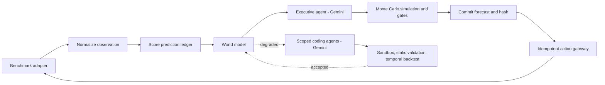

# Lithops

An autonomous operating agent for running a company over a long horizon. Gemini decides the strategy every simulated week; deterministic, hand-written code controls what it sees, prices its options, vetoes insolvency, and records everything it does. The model of the company is code: small, versioned Python modules that a coding agent writes from observed history and that must beat a boring baseline in temporal backtests before they touch a decision about money.

Lithops is environment-agnostic. It ships with an adapter for [CEO-Bench](https://ceobench.com) (a 504-day SaaS-startup simulation from Princeton) and a fake in-memory environment for development, and you can point the same loop at your own business problem by implementing one six-method interface. That's the part this README spends the most time on.

- **Live replay of a finished 504-day run:** [lithops.space](https://lithops.space)

## Results, honestly stated

On CEO-Bench seed 137, raw Gemini Flash ends its best unassisted run with $75k of the starting $1M, and the previous Flash generation goes bankrupt in all three attempts by day 150. The same model inside Lithops never went bankrupt in any run of the project, preserved most of the capital, and on the final clean run posted the seed's best early game (28 customers by week 12). It did not grow the company: a competitor quality storm around week 36 took the customer base in every attempt, and the model never bought the one R&D lever that jumps the quality bar.

A full run costs $5-40 of Gemini inference (depending on how much world-model authoring it does) and about three hours on a 2 vCPU Cloud Run Job.

## How one week works



1. Normalize the latest observation (unit registry; missing data is *missing*, never zero).
2. Score every forecast whose outcome has now arrived.
3. Update the active world model and check its health.
4. Ask the Executive for bounded strategy candidates; simulate them with common random numbers, next to a no-op.
5. Veto insolvency, name every other risk on the candidate's evaluation card, and let the Executive choose. Deterministic code vetoes and informs; the model decides.
6. Commit forecasts, model hashes and an idempotency key *before* acting, then execute through the gateway and store receipts.

When prediction quality degrades, scoped coding agents propose replacement model components. Candidate code runs in a sandbox and must beat the current champion in expanding-window temporal backtests before promotion. The old hand-written simulator was never deleted; it lives in the registry as `fixed-baseline-v1`, the opponent every candidate has to beat.

## Quickstart (no keys required)

Requirements: Python 3.12+, [uv](https://docs.astral.sh/uv/), Node.js 22.

```bash
uv sync --extra dev --extra agents
npm install

# terminal 1: API (in-memory storage, fake environment, deterministic decisions)
uv run uvicorn lithops.api.main:app --reload

# terminal 2: React cockpit
npm run frontend:dev
```

API on `http://127.0.0.1:8000`, cockpit on `http://127.0.0.1:5173`. Drive a week by hand:

```bash
RUN=$(curl -s -X POST http://localhost:8000/runs | python3 -c "import sys,json;print(json.load(sys.stdin)['id'])")
curl -s -X POST -H "Idempotency-Key: demo-week-1" http://localhost:8000/runs/$RUN/step
curl -s http://localhost:8000/runs/$RUN/decisions
curl -s http://localhost:8000/runs/$RUN/predictions
```

Replaying the same `Idempotency-Key` returns the stored result instead of acting twice. That property holds everywhere in the system.

## Run it with real models

Copy `.env.example` to `.env` and pick a provider:

```text
# Gemini through Google ADK (what the headline runs used)
LITHOPS_MODEL_PROVIDER=gemini
GEMINI_API_KEY=your-server-only-key
GEMINI_MODEL=gemini-3.7-flash

# optional persistent storage
LITHOPS_STORAGE_BACKEND=supabase
SUPABASE_URL=https://your-project.supabase.co
SUPABASE_SECRET_KEY=your-server-only-secret
```

OpenRouter (`LITHOPS_MODEL_PROVIDER=openrouter`) and fal.ai are also wired for cross-model comparisons. Keys stay on the server; nothing reaches the browser.

To run a full checkpointed CEO-Bench experiment (CEO-Bench itself is an external distribution, not vendored here):

```bash
uv run python scripts/run_ceobench_experiment.py \
  --provider gemini \
  --executable /path/to/ceobench-src/public/novamind-operation \
  --checkpoint artifacts/experiments/my-run/checkpoint.json \
  --report artifacts/experiments/my-run/report.json \
  --weeks 72 --seed 137 --executive-authority-v2
```

The experiment runner requires `SUPABASE_URL`, `SUPABASE_SECRET_KEY` and the provider key in the environment (the run ledger is what makes checkpoint resume and the replay UI work), plus a Python 3.13 interpreter for the benchmark via `--python` if your default differs.

The run commits a checkpoint after every simulated week. Kill it whenever you like; rerunning the same command resumes at the first uncommitted week.

## Point it at your own company problem

Everything above is environment-independent. The whole surface between Lithops and the world is `BenchmarkPort`, six async methods in [`backend/src/lithops/domain/ports/benchmark.py`](backend/src/lithops/domain/ports/benchmark.py):

```python
class BenchmarkPort(Protocol):
    async def create_session(self, run_id: UUID, *, days: int) -> str: ...
    async def observe_status(self, session_id: str) -> ObservationSnapshot: ...
    async def query_readonly(self, session_id: str, sql: str) -> list[dict[str, Any]]: ...
    async def collect_weekly_evidence(self, session_id: str, observation: ObservationSnapshot) -> object: ...
    async def execute_action(self, session_id: str, *, run_id: UUID,
                             decision_id: UUID, command: ActionCommand) -> ActionReceipt: ...
    async def advance_week(self, session_id: str, *, rationale: str,
                           forecasts: CashForecasts) -> ObservationSnapshot: ...
```

Write those six methods for your environment - a different benchmark, a spreadsheet-backed model of your actual business, a staging copy of your production systems - and the identical loop, world-model learning, and audit trail operate it. A minimal skeleton:

```python
class MyCompanyAdapter:
    async def create_session(self, run_id, *, days):
        return "my-company-2026"                      # any stable id

    async def observe_status(self, session_id):
        return ObservationSnapshot(
            day=self._today(),
            cash=self._ledger_balance(),
            metrics={
                "active_customers": 41.0,
                "weekly_revenue": 5210.0,
                "churn_rate": 0.03,
                # unknown is unknown - never fake a zero:
                "usage_quota_a": None,
            },
        )

    async def query_readonly(self, session_id, sql):
        raise BenchmarkContractError("no queryable store")  # legal: degrade loudly

    async def collect_weekly_evidence(self, session_id, observation):
        return None                                   # optional richer evidence packet

    async def execute_action(self, session_id, *, run_id, decision_id, command):
        # command.tool is one of your declared tools, arguments already validated
        self._apply(command.tool, command.arguments)
        return ActionReceipt(run_id=run_id, decision_id=decision_id,
                             idempotency_key=command.idempotency_key,
                             tool=command.tool,
                             semantic_command_hash=command.semantic_hash,
                             status=ReceiptStatus.EXECUTED,
                             external_reference=f"{session_id}:{command.idempotency_key}",
                             result={"ok": True})

    async def advance_week(self, session_id, *, rationale, forecasts):
        # forecasts arrive BEFORE the outcome exists - that is the point
        self._log_forecasts(forecasts)
        self._advance_time(days=7)
        return await self.observe_status(session_id)
```

Three rules we learned the expensive way:

1. **Missing is not zero.** If an instrument can't measure something, report `None` or raise - a silent `0.0` reads as knowledge and will steer a year of decisions.
2. **Declare units.** The observation adapter has a unit registry; a monthly price entering a weekly equation without an explicit conversion is a contract violation, not a rounding detail.
3. **The action and observation layers must agree on reality.** Whatever `execute_action` changes must be visible in the next `observe_status`. Our worst bug was spend that executed with receipts and never appeared in observations.

Use [`backend/src/lithops/benchmark/fake.py`](backend/src/lithops/benchmark/fake.py) (185 lines) as the reference implementation and [`backend/tests/contract/`](backend/tests/contract/) as the safety net - the contract tests run an adapter against the same expectations the CEO-Bench one has to meet. Wire yours in where `LITHOPS_BENCHMARK_BACKEND` selects the adapter (`backend/src/lithops/api/main.py`).

## Deploy on Google Cloud

Two paths, both scripted:

- `infra/cloudrun/deploy.sh` - the cockpit + API as one Cloud Run **service** (same-origin SPA + FastAPI; this is what serves [lithops.space](https://lithops.space)).
- `deploy/cloudrun/` - long experiments as a Cloud Run **Job**: image built by Cloud Build, secrets from Secret Manager, state mirrored to Cloud Storage on an interval and on exit, so a 504-day run survives its execution being killed and resumes at the next uncommitted week. `deploy.sh` builds and never spends; `execute.sh` starts a run.

```bash
PROJECT_ID=your-project CEOBENCH_PUBLIC_DIR=/path/to/ceobench-src/public bash deploy/cloudrun/deploy.sh
PROJECT_ID=your-project RUN_NAME=my-72w-run SEED=137 WEEKS=72 bash deploy/cloudrun/execute.sh
```

### Model Armor and Cloud Trace (optional, on by default in the job)

The environment writes free text into the observation (inbox threads, market
announcements), which makes it a prompt-injection surface. With
`LITHOPS_MODEL_ARMOR=monitor` every string field is screened through a Google
Cloud [Model Armor](https://cloud.google.com/security-command-center/docs/model-armor-overview)
template before the executive brief is built; verdicts, including screening
errors, land on the run's event ledger as `security.model_armor` events.
`enforce` additionally redacts flagged fields. Set
`LITHOPS_MODEL_ARMOR_TEMPLATE` to a template resource name
(`projects/<p>/locations/<l>/templates/<t>`).

`LITHOPS_TRACING=on` exports one OpenTelemetry trace per simulated week to
Cloud Trace (observe → learn → decide → execute → advance → commit), so the
reasoning chain of any week can be read as a waterfall. Both features fail
open and are disabled by default outside the job.

## Generated-code boundary

Generated model components are treated as untrusted input: AST validation, no imports, size limits, execution in a separate process with an empty environment and a wall-clock timeout. This is an application-level boundary; add container or OS-level isolation before evaluating code from unknown users.

## Tests

```bash
uv run pytest          # ~450 tests: unit, integration, contract, architecture
uv run ruff check .
npm run frontend:test && npm run frontend:build
```

## Repository layout

- `backend/src/lithops/` - domain model, application services, benchmark adapters, API, infrastructure
- `backend/tests/` - unit, integration, contract, and architecture tests
- `frontend/` - React cockpit and generated OpenAPI types
- `deploy/cloudrun/` - autonomous Cloud Run Job deployment
- `infra/` - Cloud Run service deploy and Supabase migrations
- `scripts/` - experiment runners and verification commands

## License

MIT. See [`LICENSE`](LICENSE).

Built for the All Things Agentic Hackathon (Google Cloud + Gemini). #AllThingsAgenticHackathon
